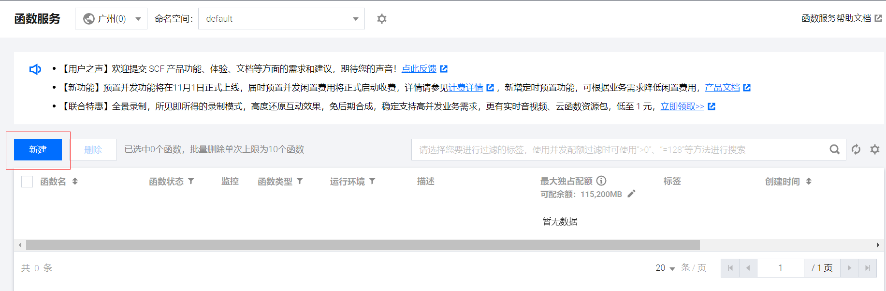
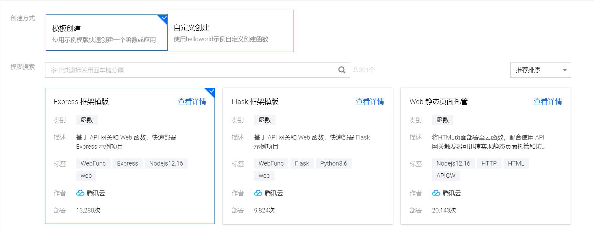

### 准备:访问腾讯云函数
[云函数直达](https://console.cloud.tencent.com/scf/list)

---

### 第零步:下载压缩包
[下载压缩包图片地址]()

---

### 第一步:创建云函数
[创建云函数图片地址](https://z3.ax1x.com/2021/10/28/5qwAmt.png)

---

### 第二步:选择模板
[选择模板图片地址]()

---
