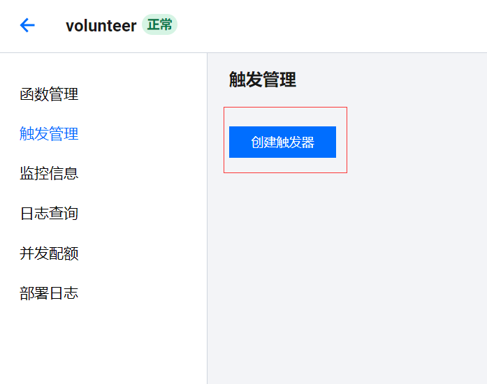
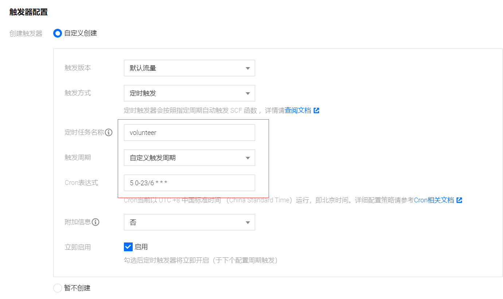

### 准备:访问腾讯云函数
[云函数直达](https://console.cloud.tencent.com/scf/list)

---

### 第零步:下载压缩包
[下载压缩包图片地址]()

---

### 第一步:创建云函数
[创建云函数图片地址]()

---

### 第二步:选择模板
[选择模板图片地址]()

---

### 第三步:云函数配置
[云函数配置图片地址]()

---

### 第四步:上传代码包
[上传代码包图片地址]()

---

### 第五步:配置执行超时
[配置执行超时图片地址]()

---

### 第六步:创建触发器
[创建触发器图片地址]()

---

### 第七步:配置触发器
[配置触发器图片地址]()

---

---

### 第八步:配置账号文件
[配置账号信息图片地址]()

---

### 第九步:配置推送文件(可选)
[创建云函数图片地址]()

---

### 第十步:部署云函数
[部署云函数图片地址]()

---
